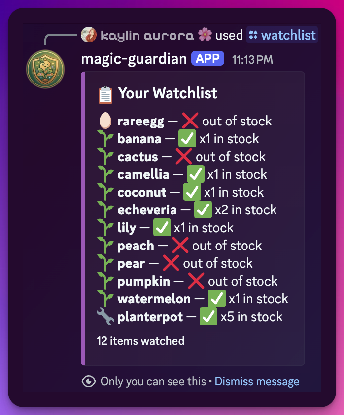
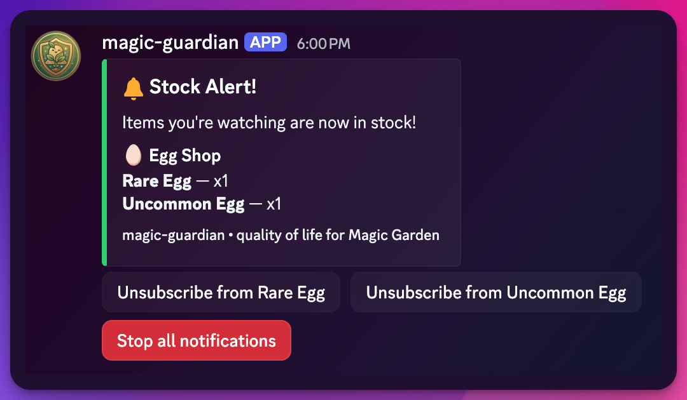
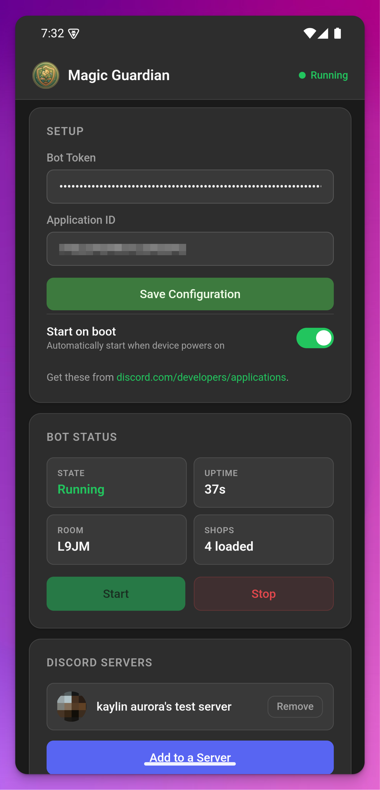

# magic-guardian

<div align="center">
  
</div>

<br>

A Discord bot that monitors Magic Garden shop inventory and sends "in stock" notifications to subscribed users. Runs on Linux, macOS, Windows, and Android.

## Features

- **Real-time shop monitoring** — connects to the Magic Garden WebSocket and tracks all 4 shops (Seed, Tool, Egg, Decor)
- **Stock alerts via DM** — get notified instantly when items you're watching come back in stock
- **Slash commands** with autocomplete:
  - `/subscribe <item>` — watch an item for stock alerts
  - `/unsubscribe <item>` — stop watching an item
  - `/watchlist` — view your subscriptions with stock status
  - `/stock [shop]` — browse current shop inventory
  - `/restock` — see time until next restock
  - `/setup-stock-board` — create a live stock board for your server
- **Batched notifications** — one DM per restock event, not per item
- **SQLite persistence** — subscriptions survive restarts
- **Auto-reconnect** — recovers from WebSocket disconnects
- **Web UI** — browser-based dashboard for configuration and monitoring
- **Android app** — run the bot from your phone with a native APK

## Screenshots

| Watchlist | Stock Alert |
|-----------|-------------|
|  |  |

## Running the Bot

The bot can run in two modes:

- **Headless mode** (default) — CLI-based, reads from `.env` file
- **Web UI mode** — Starts an embedded web server for browser-based setup and control

### Headless Mode (CLI)

```bash
# Configure credentials
echo "DISCORD_TOKEN=your_bot_token_here" > .env
echo "DISCORD_APP_ID=your_app_id_here" >> .env

# Run
./magic-guardian
```

### Web UI Mode

```bash
# Start with the -ui flag (listens on localhost:8090 by default)
./magic-guardian -ui

# Or with custom options
./magic-guardian -ui -listen "0.0.0.0:8080" -db "mydata.db" -auto-start
```

The web UI lets you configure the bot through your browser without needing a `.env` file. Access it at `http://localhost:8090` after starting.

---

## Getting Started

> [!IMPORTANT]
> You need valid credentials from the [Discord Developer Portal](https://discord.com/developers/home) before getting started:
> - `DISCORD_TOKEN` — Bot → Reset Token → Copy
> - `DISCORD_APP_ID` — General Information → Application ID

Choose how you want to run the bot:

---

### Option A: Download Binary (Recommended)

Pre-built binaries are available on the [releases page](https://github.com/kaylincoded/magic-guardian/releases).

| Platform | Download Command |
|----------|------------------|
| Linux amd64 | `wget https://github.com/kaylincoded/magic-guardian/releases/download/v0.2.0/magic-guardian-linux-amd64` |
| Linux arm64 | `wget https://github.com/kaylincoded/magic-guardian/releases/download/v0.2.0/magic-guardian-linux-arm64` |
| macOS Intel | `curl -O https://github.com/kaylincoded/magic-guardian/releases/download/v0.2.0/magic-guardian-darwin-amd64` |
| macOS Apple Silicon | `curl -O https://github.com/kaylincoded/magic-guardian/releases/download/v0.2.0/magic-guardian-darwin-arm64` |
| Windows | `curl -O https://github.com/kaylincoded/magic-guardian/releases/download/v0.2.0/magic-guardian-windows-amd64.exe` |
| Android (APK) | [Download from releases page](https://github.com/kaylincoded/magic-guardian/releases/download/v0.2.0/magic-guardian-android.apk) |

Then configure and run:

```bash
# Make executable (Linux/macOS)
chmod +x magic-guardian-*

# Configure credentials
echo "DISCORD_TOKEN=your_bot_token_here" > .env
echo "DISCORD_APP_ID=your_app_id_here" >> .env

# Run
./magic-guardian-linux-amd64
```

---

### Option B: Android

<div align="center">
  
</div>

<br>

1. Download `magic-guardian-android.apk` from the [releases page](https://github.com/kaylincoded/magic-guardian/releases)
2. On your Android device, enable **Install from unknown sources** in Settings
3. Open the APK to install
4. Launch "Magic Guardian" from your app drawer
5. Enter your Bot Token and Application ID, tap **Save Configuration**
6. Tap **Start** to launch the bot

The Android app runs the bot as a foreground service with a web-based dashboard. It keeps running in the background and can auto-start on boot.

> [!NOTE]
> The Android app requires Android 8.0 (API 26) or higher. It runs the same Go engine as the desktop version, with a WebView-based UI at `localhost:8090`.

---

### Option C: Build from Source

```bash
# Clone and build
git clone https://github.com/kaylincoded/magic-guardian.git
cd magic-guardian
go build -o magic-guardian ./cmd/magic-guardian/

# Configure and run
echo "DISCORD_TOKEN=your_bot_token_here" > .env
echo "DISCORD_APP_ID=your_app_id_here" >> .env
./magic-guardian
```

#### Cross-compile for Android

Requires the [Android NDK](https://developer.android.com/ndk):

```bash
export NDK=/path/to/android-ndk
export CC=$NDK/toolchains/llvm/prebuilt/darwin-x86_64/bin/aarch64-linux-android26-clang

CGO_ENABLED=1 GOOS=android GOARCH=arm64 CC=$CC \
  go build -ldflags="-s -w" -o libguardian.so ./cmd/magic-guardian/
```

Then place `libguardian.so` in `android/app/src/main/jniLibs/arm64-v8a/` and build the APK with Gradle.

---

### Invite the Bot

Use this URL template (replace `APP_ID`):

```
https://discord.com/oauth2/authorize?client_id=APP_ID&permissions=93200&scope=bot
```

Permissions needed: **Manage Channels, Manage Messages, Embed Links, View Channel, Read Message History** (integer `93200`)

## Policy Compliance

> [!IMPORTANT]
> This bot is designed to comply with Magic Garden's bot policy. It operates as a **read-only observer** — it connects anonymously, receives shop data, and does nothing else. No automation, no buying, no game actions.

> [!NOTE]
> **What does "policy-compliant" mean?**
>
> Magic Garden allows third-party tools that respect their boundaries. This bot makes a best-effort attempt to comply by:
>
> - Never sending game commands or automating player actions
> - Connecting as an anonymous observer (no authenticated player session)
> - Only reading shop inventory data — never interacting with game objects
> - Being transparent about what it does
>
> **Official policy:** [Magic Circle Discord](https://discord.com/invite/magiccircle) | [Bot & Tool Policy](https://ptb.discord.com/channels/808935495543160852/1428205518278885457/1428205518278885457) (Discord login required)

## Architecture

```
cmd/magic-guardian/main.go       Entry point (headless + web UI modes)
internal/mg/client.go            WebSocket client (connect, heartbeat, reconnect)
internal/mg/messages.go          Protocol types (Welcome, PartialState, Patch)
internal/mg/shop.go              Shop state management, patch application
internal/mg/discover.go          Auto-discovers game version and room ID
internal/notify/engine.go        Matches stock events to subscriptions
internal/discord/bot.go          Discord session, slash commands, autocomplete
internal/discord/embeds.go       Rich embed builders for all responses
internal/discord/board.go        Live stock board management
internal/store/sqlite.go         SQLite subscription + config persistence
internal/webui/server.go         Embedded HTTP server, REST API, SSE logs
internal/webui/controller.go     Bot lifecycle management for web UI mode
internal/webui/loghandler.go     Multi-handler slog (stdout + web buffer)
internal/webui/static/           Embedded web dashboard (go:embed)
android/                         Kotlin Android wrapper (WebView + foreground service)
```

## Documentation

| Doc | Description |
|-----|-------------|
| [📖 Architecture](./docs/architecture.md) | Component diagrams, data flow, concurrency model |
| [🔌 API Contracts](./docs/api-contracts.md) | Slash commands, message components, event callbacks |
| [🗃️ Data Models](./docs/data-models.md) | Database schema, Go types, protocol structures |
| [🛠️ Development Guide](./docs/development-guide.md) | Setup, coding conventions, testing, deployment |

Or browse the [full documentation index](./docs/index.md).

## How It Works

1. Connects to `wss://magicgarden.gg` as an anonymous player
2. Receives `Welcome` message with full shop inventory + restock timers
3. Monitors `PartialState` patches (JSON Patch RFC 6902) every ~1s
4. When `initialStock` changes from 0 → N, the item is "now in stock"
5. Matches against user subscriptions and sends batched Discord DMs

## License

MIT
